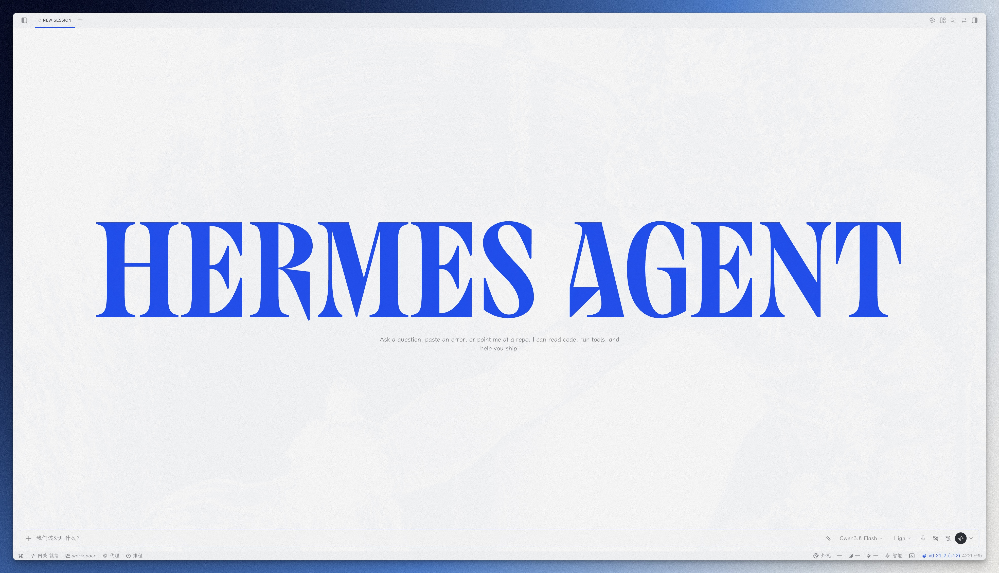
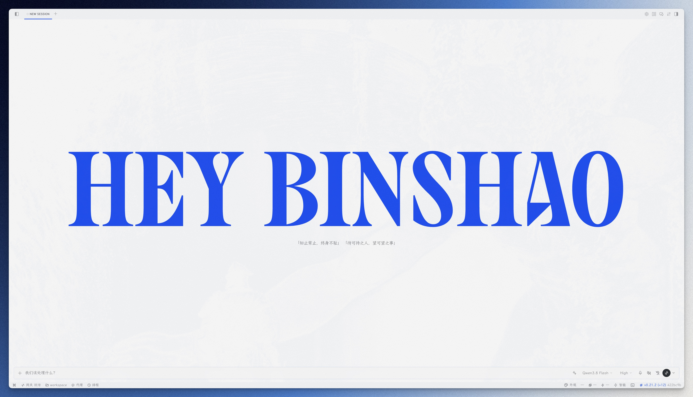

# Hermes Appearance Hub 

给 Hermes 桌面端用的**外观整合插件**：把散在官方设置页各处的外观与对话行为开关，连同纸纹模拟、霞鹜文楷、Binshao 主题等独有能力，收进状态栏一个浮窗——悬停即见说明，改动即时生效，省掉翻设置页的路径。

## 特性

- 无需构建、不改应用代码——单个 ESM 文件
- 状态栏「外观」入口，右键可显隐
- 双栏面板 · 每行只留标题，悬停即见简介（底部说明带）
- 主题（12 个，含 Binshao 暖纸）· 语言简/繁/EN · 霞鹜文楷 · 纸纹模拟 · 界面缩放
- 聊天背景 · 消息气泡 · 窗口透明 · 开场标识 · 对话行为五件套（工具调用显示 / 折叠推理 / 内嵌预览 / 悬浮输入框 / 应用操作）
- 设置持久化，卸载清理注入、不留残留

## 界面预览

### 外观浮窗

点击状态栏「外观」按钮弹出，双栏铺开；每行只留标题，悬停任一设置项，底部说明带显示该项简介：


### Binshao 主题

暖纸色系明暗双模式，配纸纹模拟使用更佳——亮色泛黄杂志纸，暗色深棕纸：


### 开场标识

原生文案（官方字标与随机提示语）：



自定义文案（字标与提示语均可替换）：



### 字体 + 纸纹 · 浅色

未启用（系统字体、无纸纹）：


启用后（霞鹜文楷 + 宣纸纸纹）：


### 字体 + 纸纹 · 暗色

未启用（系统字体、无纸纹）：


启用后（霞鹜文楷 + 宣纸纸纹）：


## 字体依赖（灵魂注入！！！）

全局字体功能使用 **霞鹜文楷（LXGW WenKai）** 与 **霞鹜文楷 Mono（LXGW WenKai Mono）**：

- 字体仓库：[lxgw/LxgwWenKai](https://github.com/lxgw/LxgwWenKai)（SIL Open Font License 1.1，开源可商用）
- **需装到系统**：插件只用本机已装的系统字体，不走 CDN。没装则回退系统默认字体
- 一款字体撑起整个界面的气质——向字体作者 **lxgw** 致敬：没有这份优秀的开源中文字体，就没有这个插件的灵魂

## 安装

把下面这句话直接发给 Hermes 就行：

```
从 Git 安装这个桌面插件：https://github.com/Heybinshao/hermes-appearance-hub ，顺便去 https://github.com/lxgw/LxgwWenKai 下载 Regular 和 Mono 字体装到系统，装好后重载插件并告诉我怎么用
```

Hermes 会把仓库 clone 进 `~/.hermes/desktop-plugins/`（留下 Git 来源记录，升级时重做一遍上述安装即可拉最新版），再下载安装字体并重载，无需手动操作。

手动安装（等价方式）：

```bash
# 把插件目录复制到 Hermes 桌面插件目录
git clone https://github.com/Heybinshao/hermes-appearance-hub ~/.hermes/desktop-plugins/hermes-appearance-hub
```

字体需装到系统：到 [lxgw/LxgwWenKai](https://github.com/lxgw/LxgwWenKai) 下载 Regular 和 Mono，装好后重载插件。没装则界面回退系统默认字体。

> 如果 Hermes 使用了非默认 profile，插件目录是 `~/.hermes/profiles/<name>/desktop-plugins/`。
> 不确定时在桌面端「技能与工具 → 插件」里查看插件目录路径。

## 使用

1. 状态栏右侧出现「外观」按钮（调色盘图标），点击弹出浮窗
2. 每行只留标题，鼠标悬停任一设置项，底部说明带显示该项简介（不悬停时显示占位提示）；多数能力即时生效，标签栏、会话列表密度随下次布局变化生效：
   - **主题**：右上角明亮/暗色/系统三档、简/繁/EN 语言三键；网格区 12 个主题点击即切（11 个原生 + Binshao）
   - **聊天背景**：雕像图片显隐开关
   - **对话行为**：工具调用显示（产品/技术）· 默认折叠推理过程 · 内嵌预览（询问/总是/关闭）· 悬浮输入框（拖出停靠区开关）· 应用操作（标题栏控件左/右）——与官方设置页同键直驱，即时生效
   - **标签栏 / 会话列表密度**：与设置页同源，改动落盘后随下次布局变化生效（如切换/新建会话）
   - **消息气泡**：拖杆调节自己消息气泡的透明度（0 不透明 → 100 只剩边框），与官方设置页同键同步
   - **窗口透明**：透明/玻璃模式 + 强度滑杆，玻璃模式展开淡出/磨砂质感/应用范围；通过官方 IPC 实时驱动原生窗口效果
   - **霞鹜文楷**：界面字体一键开关（需装到系统）；官方设置页自定义了聊天字体时自动让位，清空后自动恢复
   - **纸纹模拟**：噪点层随明暗自动切换；下方配方可选极轻/微调/经典/贴地（暗色）或贴顶（浅色），从左到右由轻到重；关时配方区锁定不可选
   - **开场标识**：关/开即时生效（与官方设置页开关同键同步）；原生文案/自定义与输入框常驻显示，按档位分层启用（关→整块锁定；开+原生→输入框锁定；开+自定义→可编辑字标与提示语，停手约半秒自动生效）；禁用插件会还原官方文案
   - **界面缩放**：底部右角六档按钮，直接驱动 Hermes 原生缩放，与设置/View 菜单同步
3. 状态栏右键菜单 → 勾选「外观设置」可显示/隐藏入口

> **界面缩放** 六档（90/100/110/125/150/175%）直接调用 Hermes 原生缩放接口
> （`window.hermesDesktop.zoom`），与系统「设置 → 外观 → 界面缩放」、顶部 View 菜单、Cmd/Ctrl ±
> 共用同一套主进程缩放机制，最终值互相一致（都持久化到同一处）。

## 卸载

删除插件目录 + 重启桌面端：

```bash
rm -rf ~/.hermes/desktop-plugins/hermes-appearance-hub
```

插件被禁用/删除时会自动移除所有注入（纸纹层、字体、开场标识替换等）并还原官方设置，不留残留。

## 关于作者

**彬少** —— 一个什么都折腾一下的人：装系统 · 玩AI · 搭知识库 · 做设计。这个仓库里的东西都是我自己的卡点长出来的，日常在用，做完就开源。

微信公众号 **「宝藏彬少」**：折腾，是为了更好用。欢迎关注交流。

## 许可证

[MIT](LICENSE) © 2026 Binshao
