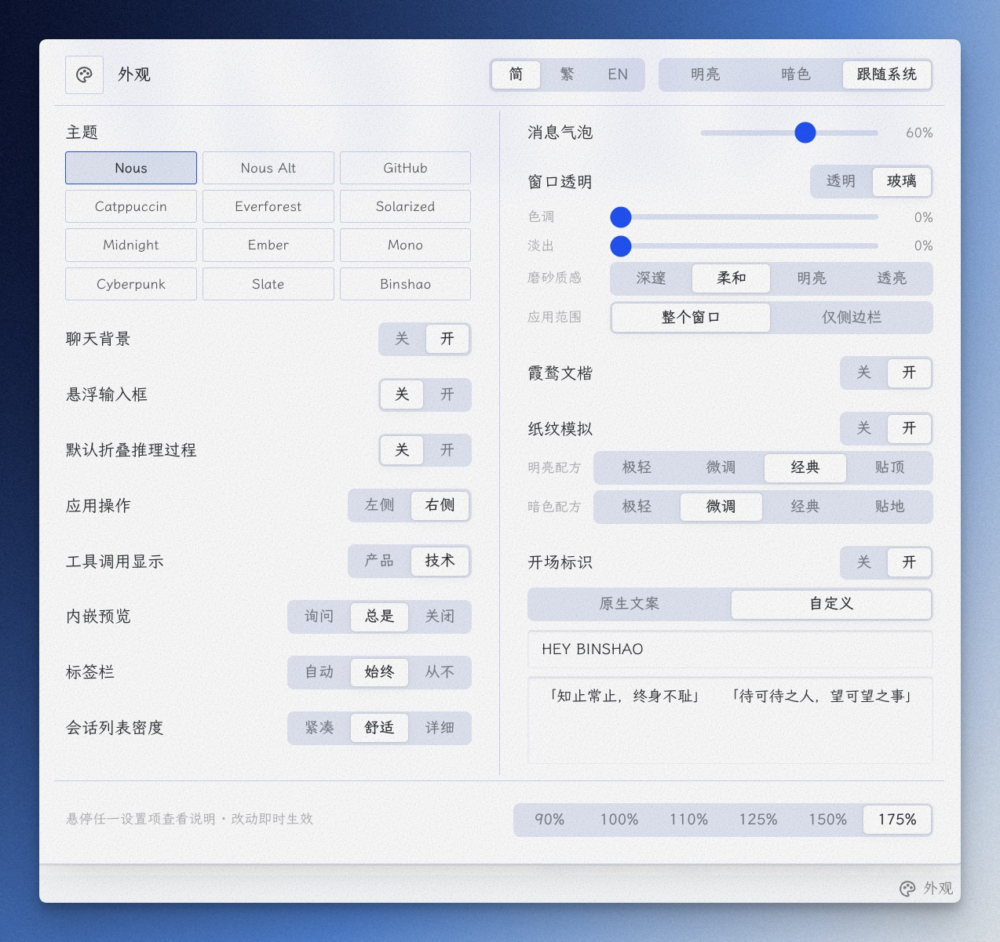
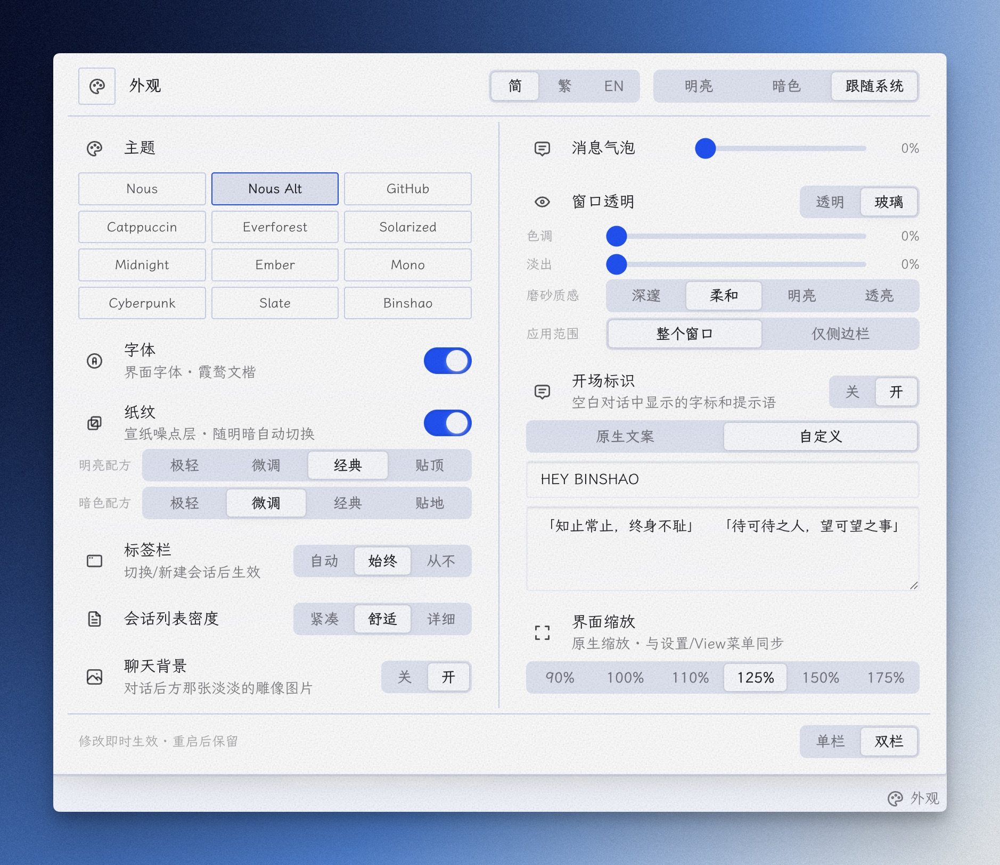
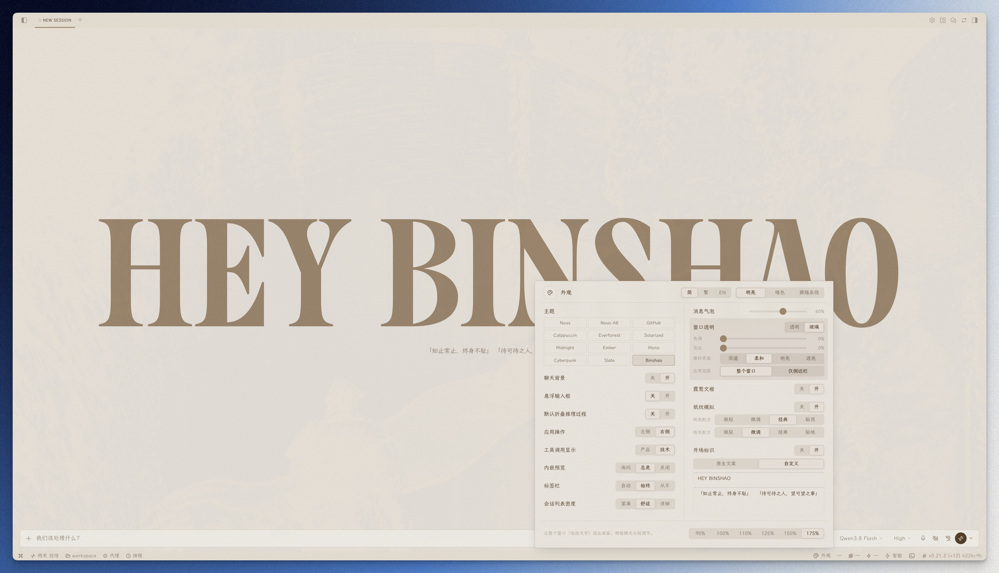
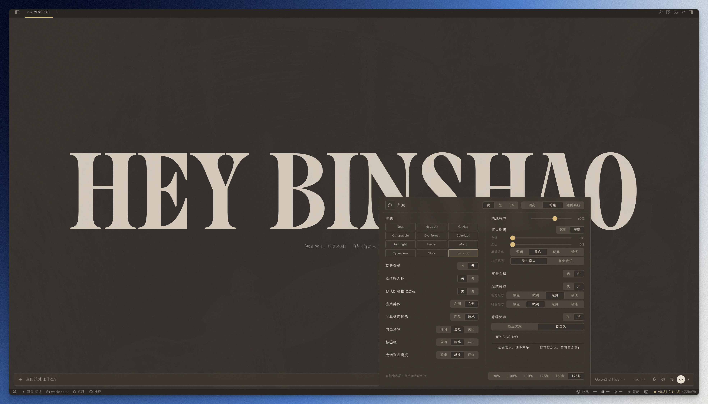
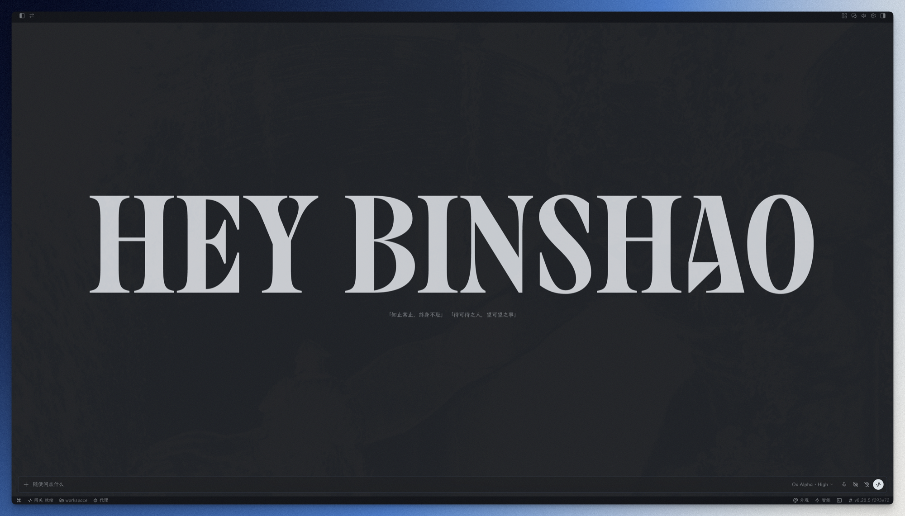

# Hermes Appearance Hub 

给 Hermes 桌面端用的**外观整合插件**：把主题、纸纹、字体、缩放、标签栏、密度、聊天背景、窗口透明、开场标识等外观设置收进一个状态栏入口，一键管理，设置持久化。

## 特性

- 无需构建、不改应用代码——单个 ESM 文件
- 状态栏「外观」入口，右键可显隐
- 主题（12 个，含 Binshao 暖纸）· 语言简/繁/EN · 霞鹜文楷 · 纸纹 · 缩放 · 标签栏 · 密度 · 聊天背景 · 窗口透明 · 开场标识 · 单/双栏
- 设置持久化，卸载清理注入、不留残留

## 界面预览

### 状态栏右键菜单

可勾选显示/隐藏「外观设置」入口：


### 外观浮窗 · 单栏

点击状态栏「外观」按钮弹出。多数能力即时生效；标签栏、会话列表密度随下次布局变化生效：



### 外观浮窗 · 双栏

底部「单栏 / 双栏」开关一键切换，双栏下面板高度减半，矮屏/大缩放不再需要滚动：



### Binshao 主题

暖纸色系明暗双模式，配纸纹层使用更佳——亮色泛黄杂志纸，暗色深棕纸：





### 开场标识自定义

新会话空态字标与提示语替换为自定义文案：



### 字体 + 纸纹 · 浅色

未启用（系统字体、无纸纹）：


启用后（霞鹜文楷 + 宣纸纸纹）：


### 字体 + 纸纹 · 暗色

未启用（系统字体、无纸纹）：


启用后（霞鹜文楷 + 宣纸纸纹）：


## 依赖字体

全局字体功能使用 **霞鹜文楷（LXGW WenKai）** 与 **霞鹜文楷 Mono（LXGW WenKai Mono）**：

- 字体仓库：[lxgw/LxgwWenKai](https://github.com/lxgw/LxgwWenKai)（MIT License，开源可商用）
- **需装到系统**：插件只用本机已装的系统字体，不走 CDN。没装则回退系统默认字体

## 安装

把下面这句话直接发给 Hermes 就行：

```
安装一下 https://github.com/Heybinshao/hermes-appearance-hub 这个桌面插件，顺便去 https://github.com/lxgw/LxgwWenKai 下载 Regular 和 Mono 字体装到系统，装好后重载插件并告诉我怎么用
```

Hermes 会自动 clone 插件到桌面插件目录、下载安装字体并重载，无需手动操作。

手动安装（等价方式）：

```bash
# 把插件目录复制到 Hermes 桌面插件目录
git clone https://github.com/Heybinshao/hermes-appearance-hub ~/.hermes/desktop-plugins/hermes-appearance-hub
```

字体需装到系统：到 [lxgw/LxgwWenKai](https://github.com/lxgw/LxgwWenKai) 下载 Regular 和 Mono，装好后重载插件。没装则界面回退系统默认字体。

> 如果 Hermes 使用了非默认 profile，插件目录是 `~/.hermes/profiles/<name>/desktop-plugins/`。
> 不确定时在桌面端 Settings → Plugins 里查看插件目录路径。

## 使用

1. 状态栏右侧出现「外观」按钮（调色盘图标），点击弹出浮窗
2. 多数能力即时生效；标签栏、会话列表密度随下次布局变化生效：
   - **主题**：右上角明亮/暗色/系统三档；网格区 12 个主题点击即切（11 个原生 + Binshao）
   - **语言**：简/繁/EN 三键，绑定官方语言通道（双栏在顶部标题行、单栏在主题标题行）
   - **字体**：霞鹜文楷界面字体一键开关
   - **纸纹**：噪点层随明暗自动切换；下方配方可选极轻/微调/经典/贴地（暗色）或贴顶（浅色），从左到右由轻到重
   - **界面缩放**：六档按钮，直接驱动 Hermes 原生缩放，与设置/View 菜单同步
   - **标签栏 / 会话列表密度**：与设置页同源，改动落盘后随下次布局变化生效（如切换/新建会话）
   - **聊天背景**：雕像图片显隐开关
   - **窗口透明**：透明/玻璃模式 + 强度滑杆，玻璃模式展开淡出/磨砂质感/应用范围；通过官方 IPC 实时驱动原生窗口效果
   - **开场标识**：关/开与官方设置页同键同步；开启时可选「原生文案」或「自定义」（输入字标与提示语，停手约半秒自动生效）；禁用插件会还原官方文案
   - **单栏 / 双栏**：浮窗底部右侧开关，双栏横向铺开、高度减半；切换即时生效并记住选择
3. 状态栏右键菜单 → 勾选「外观设置」可显示/隐藏入口

> **界面缩放** 六档（90/100/110/125/150/175%）直接调用 Hermes 原生缩放接口
> （`window.hermesDesktop.zoom`），与系统「设置 → 外观 → 界面缩放」、顶部 View 菜单、Cmd/Ctrl ±
> 共用同一套主进程缩放机制，最终值互相一致（都持久化到同一处）。

## 卸载

删除插件目录 + 重启桌面端：

```bash
rm -rf ~/.hermes/desktop-plugins/hermes-appearance-hub
```

插件被禁用/删除时会自动移除所有注入（纸纹层、字体、开场标识替换等）并还原官方设置，不留残留。

## 原理简述

- **纸纹**：全屏 fixed 背景层（z-index 最大 + `pointer-events: none` 不挡点击），纹理 = SVG `feTurbulence` 噪点 data URI（无外部图片依赖）；浅色 `multiply`、深色 `screen`，`MutationObserver` 跟随明暗切换
- **字体**：注入 `:root { --dt-font-sans/--dt-font-mono: 'LXGW WenKai' !important }`，压过主题的 inline 字体设置
- **开场标识**：定位原生开关的 localStorage 键（`hermes.desktop.intro-splash.v1`）做落盘同步；自定义文字用 `MutationObserver` 直接替换 `[data-slot="aui_intro"]` 内 fit-text 叶子 span 的文本——不碰应用代码，React 重渲染写回也会被重新替换；禁用时移除注入并还原原文案
- **密度/标签栏/聊天背景**：直写官方 localStorage 键，并通过动态 import 官方打包 chunk 拿到 nanostores atom 实时驱动界面（运行时按行为特征识别 atom，无硬编码混淆名）；atom 未识别时退回 localStorage 直写
- **窗口透明**：写 TranslucencyBook JSON 后直接调用 `window.hermesDesktop.setTranslucency()` IPC，实时驱动原生窗口效果
- **双栏布局**：面板区块提取为列表后按列分配渲染，标题行通栏；布局选择持久化到插件 storage，单栏模式与原始布局完全一致
- **Binshao 主题**：主题种子写入官方用户主题 localStorage 键（`hermes-desktop-user-themes-v1`），经官方 `resolveTheme` 生效；另注入一小段作用域锁定的 CSS（选中色/输入框底/行内代码），补齐主题管道外的硬编码色

## 关于作者

**彬少** —— 一个什么都折腾一下的人：装系统 · 玩AI · 搭知识库 · 做设计。这个插件是我自己在用的桌面端外观整合，分享出来给同样在折腾 Hermes 的朋友。

微信公众号 **「宝藏彬少」**：折腾，是为了更好用。欢迎关注交流。

---

## 许可证

MIT
