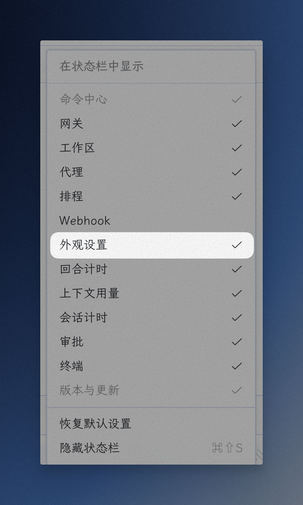
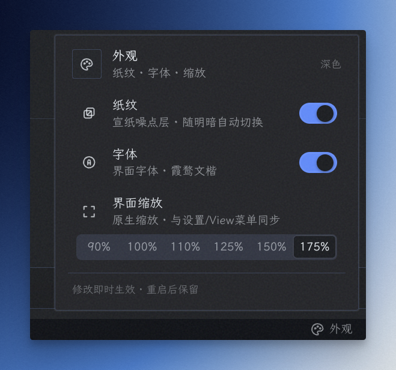
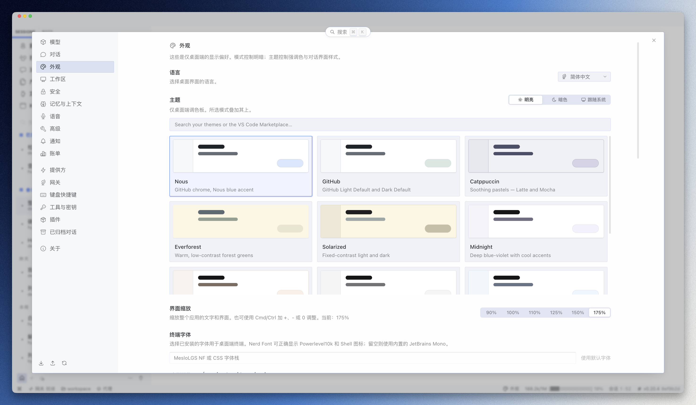
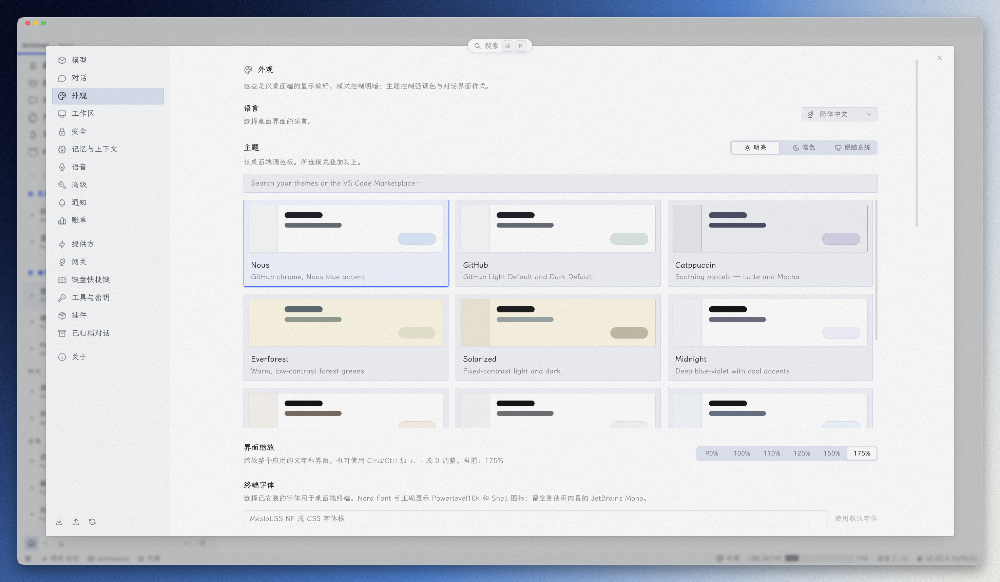
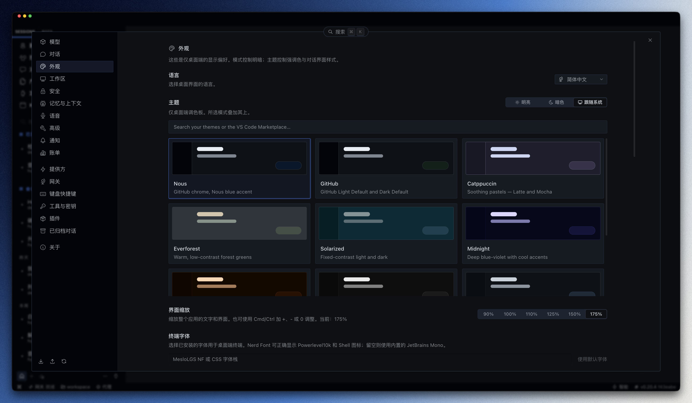
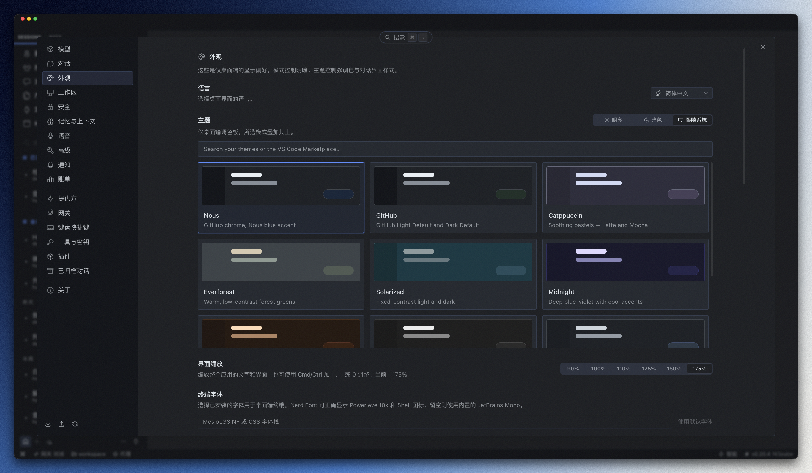

# Hermes Appearance Hub

给 Hermes 桌面端用的**外观整合插件**：把「纸纹」和「全局字体」两个能力收进一个状态栏入口，一键开关，设置持久化。

- ✅ 无需构建、不改应用代码——单个 ESM 文件
- ✅ 状态栏「外观」按钮 → 浮窗开关，与核心状态栏工具同款交互
- ✅ 两个开关：**纸纹**（宣纸噪点层）+ **字体**（霞鹜文楷界面字体）
- ✅ 设置持久化（重启/热更新保留），插件卸载自动清理，不留残留
- ✅ 状态栏右键菜单可勾选显隐入口

## 依赖字体

全局字体功能使用 **霞鹜文楷（LXGW WenKai）** 与 **霞鹜文楷 Mono（LXGW WenKai Mono）**：

- 字体仓库：[lxgw/LxgwWenKai](https://github.com/lxgw/LxgwWenKai)（MIT License，开源可商用）

> 字体需先在本机安装，未安装时自动回退系统字体。

## 安装

```bash
# 把插件目录复制到 Hermes 桌面插件目录
cp -r hermes-appearance-hub ~/.hermes/desktop-plugins/
```

然后 **Cmd+Q 完全退出 Hermes Desktop 再打开**（或 ⌘K → **Reload desktop plugins**）。

> 如果 Hermes 使用了非默认 profile，插件目录是 `~/.hermes/profiles/<name>/desktop-plugins/`。
> 不确定时在桌面端 Settings → Plugins 里查看插件目录路径。

## 界面预览

**状态栏右键菜单** —— 可勾选显示/隐藏「外观设置」入口：



**外观浮窗** —— 点击状态栏「外观」按钮弹出，两个开关即时生效：



**浅色模式效果对比** —— 左：未启用（系统字体、无纸纹）；右：启用后（霞鹜文楷 + 宣纸纸纹）：

| 未启用 | 启用纸纹 + 字体 |
|---|---|
|  |  |

**暗色模式效果对比** —— 左：未启用（系统字体、无纸纹）；右：启用后（霞鹜文楷 + 宣纸纸纹）：

| 未启用 | 启用纸纹 + 字体 |
|---|---|
|  |  |

## 使用

1. 状态栏右侧出现「外观」按钮（调色盘图标）
2. 点击弹出浮窗，两个开关即时生效：
   - **纸纹**：宣纸噪点层，浅色=纸纤维暗纹，深色=柔和颗粒，随明暗主题自动切换
   - **字体**：界面字体统一为霞鹜文楷（`--dt-font-sans/mono` + `!important`，任何主题下生效）
3. 状态栏右键菜单 → 勾选「外观设置」可显示/隐藏入口

## 卸载

删除插件目录 + 重启桌面端：

```bash
rm -rf ~/.hermes/desktop-plugins/hermes-appearance-hub
```

插件被禁用/删除时会自动移除注入的纸纹层与字体样式，不留残留。

## 原理简述

- **纸纹**：全屏 fixed 背景层（z-index 最大 + `pointer-events: none` 不挡点击），纹理 = SVG `feTurbulence` 噪点 data URI（无外部图片依赖）；浅色 `multiply`、深色 `screen`，`MutationObserver` 跟随明暗切换
- **字体**：注入 `:root { --dt-font-sans/--dt-font-mono: 'LXGW WenKai' !important }`，压过主题的 inline 字体设置

## License

MIT
